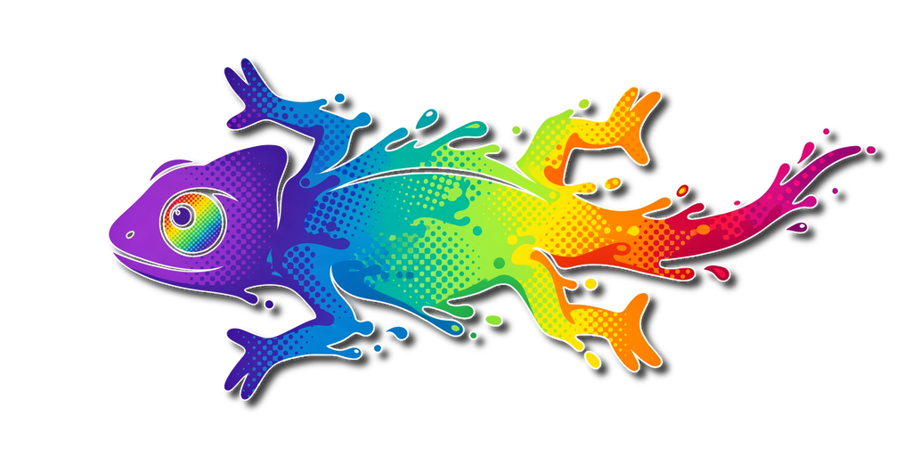
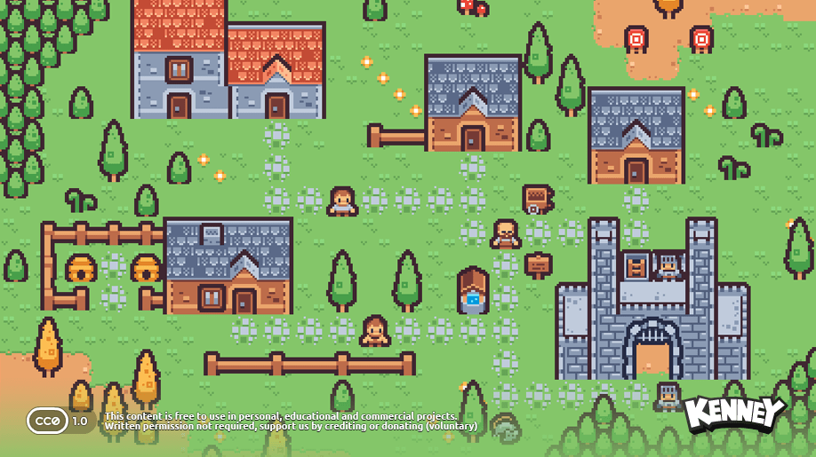
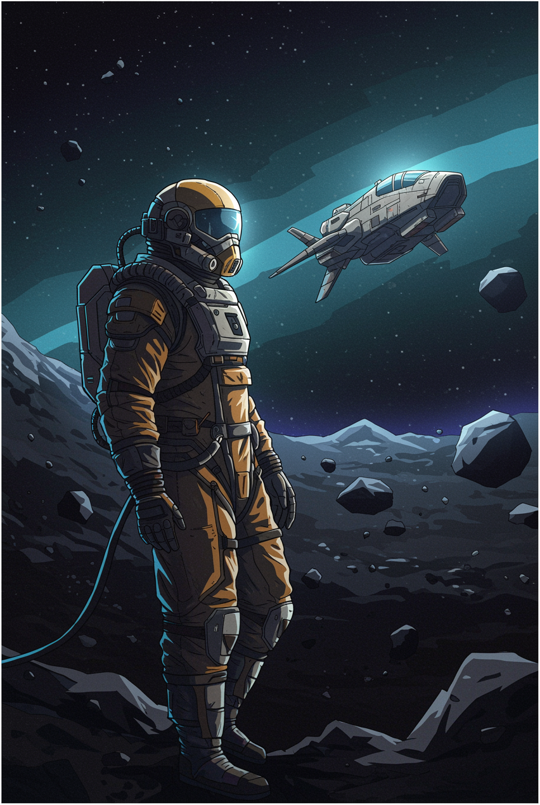
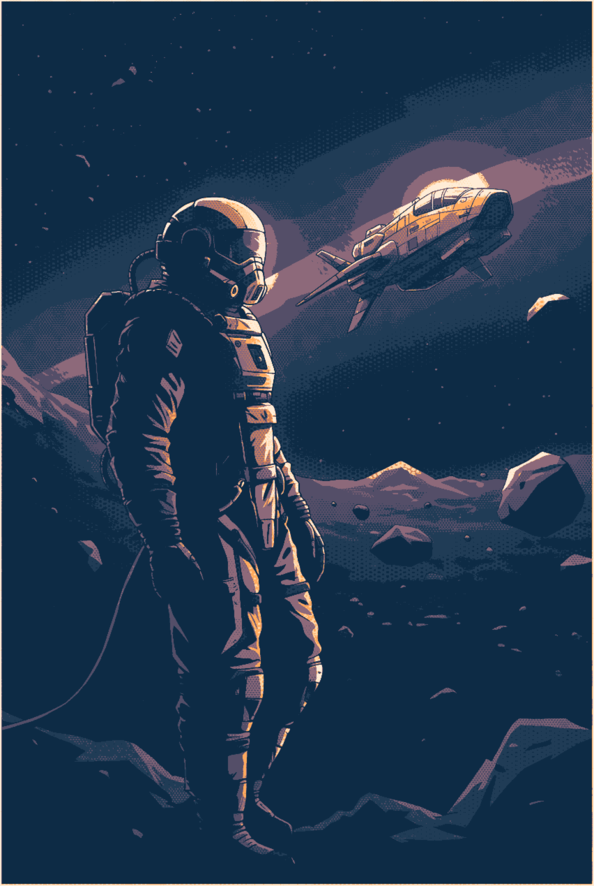

<div align="center">
  
</div>

<h1 align="center">Paletti - The Image Chameleon</h1>
<p align="center"><em>Apply colour palettes to images from the command line.</em></p>

`paletti` is a Python reinterpretation of the palette / dithering shader demonstrated in
[Palette Shader 2](https://greenf0x.itch.io/paletteshader2) Godot 3 utility by [GreenF0x](https://greenf0x.itch.io/). 

For each pixel it finds the two nearest palette colours and then snaps, blends, or ordered-dithers between them.

Paletti does a bunch more, such as allow easily ad-hoc composed palettes and adjusting metrics and dithering patterns per color channel.

The utility defaults to the OKLAB color space, enabling it to match perceptually similar colors.

## Showcase

`paletti` works on all kinds of source art — from chunky pixel art to
3D-rendered lighting. The examples below run a source through a range of
palettes and dither settings.

<table>
  <tr>
    <td width="50%" align="center"><strong>Use Case: Pixel Art Palette Swaps</strong></td>
  </tr>
  <tr>
    <td></td>
  </tr>
</table>

<table>
  <tr>
    <td width="50%" align="center"><strong>Use Case: SVG Recoloring</strong></td>
  </tr>
  <tr>
    <td>
    </td>
  </tr>
</table>

<table>
  <tr>
    <td width="50%" align="center"><strong>Use Case: Illustrative Reshading / Dithering</strong></td>
  </tr>
  <tr>
    <td></td>
  </tr>
</table>

<table>
  <tr>
    <td width="50%" align="center"><strong>Use Case: Re-Lighting Art and Photos</strong></td>
  </tr>
  <tr>
    <td><video src="https://github.com/user-attachments/assets/5f70a718-7602-44a9-a1f6-e6cda5a2658c" width="448" autoplay loop muted></video></td>
  </tr>
</table>

## Install / run

This is a [uv](https://docs.astral.sh/uv/) project:

```sh
uv sync
uv run paletti --help
```

## Usage

```sh
paletti INPUT [OUTPUT] -p PALETTE [options]
```

If `OUTPUT` is omitted, the result is written next to the input as
`paletti-<input-name>.png` (e.g. `paletti in.png -p pal.png` → `paletti-in.png`);
an SVG input defaults to `paletti-<input-name>.svg` (see [SVG input](#svg-input)).

Each palette source (`-p` / `--palette`) can be:

- **an image** — its distinct colours become the palette
  (`-p palette.png`, optionally `--max-colors 16`);
- **a JSON file** — `-p sweetie16.json`;
- **an inline JSON array** — `-p '["#1a1c2c","#5d275d"]'`;
- **a bare hex/name colour** — `-p 000`, `-p '#1a1c2c'`, `-p lavender`.

`-p` is **repeatable and variadic**, and every source is concatenated into one
palette. Repeat the flag or list sources after a single `-p`:

```sh
paletti in.png out.png -p 000 -p palette.json -p lospec-pal8.png
paletti in.png out.png -p 000 palette.json lospec-pal8.png lavender
```

A bare colour token accepts any of:

- **hex** — with or without a leading `#`, in 3- or 6-digit form (`000`, `#000`,
  `1a1c2c`, `#1a1c2c`);
- a **CSS/SVG colour name** — `white`, `lavender`, `rebeccapurple`;
- a **CSS colour function** — `rgb()`, `hsl()`, `hsv()`/`hsb()`, `hwb()`,
  `lab()`, `lch()`, `oklab()`, `oklch()`, in either the legacy comma form or the
  modern space-separated CSS Color 4 syntax. Hue units (`deg`/`grad`/`rad`/
  `turn`) and percentages are honoured; a trailing `/ alpha` is parsed and
  ignored. Colours outside the sRGB gamut are clipped.

```sh
paletti in.png out.png -p 'rgb(255 0 0)' 'hsl(120deg 100% 50%)' 'oklch(0.7 0.15 30)'
```

(Quote any token containing spaces, `#`, or parentheses so the shell passes it
through intact.) A token that names an existing file is read as that file, so
files always win over same-named colours.

JSON palettes accept the same hex strings, colour names and colour functions,
plus `0..255` integer triples (`[26, 28, 44]`) or `0..1` float triples
(`[0.1, 0.11, 0.17]`). The numeric range is detected automatically; override
with `--palette-range`.

Because a variadic `-p` greedily consumes the values that follow it, place it
after the image paths (or before another flag).

### How the two nearest colours are combined

By default each pixel snaps to its closest palette colour. Two flags change that:

| selection             | result                                                          |
|-----------------------|----------------------------------------------------------------|
| (default)             | snap each pixel to the closest palette colour                   |
| `--blend`             | smooth lerp between the two nearest colours                     |
| `--dither KIND`       | ordered dither between the two nearest colours (1-bit edges, or soften with `--antialias`) |
| `--dither KIND --rgb` | ordered dither each RGB channel independently, then snap to the palette (dissolves banding; great with `--dither bayer` or a blue-noise `--dither texture`). With an RGB `--texture` each colour channel drives the matching image channel; a greyscale texture is reused with a 1/3 phase shift per channel. |

`--blend` and `--dither` are mutually exclusive. `KIND` is one of
`nearest`, `sine`, `bayer`, `halftone`, `texture`.

### Examples

```sh
# Quantise to a palette extracted from an image
paletti photo.png out.png -p lospec-palette.png

# Dither against a 16-colour palette using an 8x8 Bayer matrix
paletti photo.png out.png -p sweetie16.json --dither bayer --bayer 8

# Halftone / screentone dots (classic 45-degree grid, 8px dot spacing)
paletti photo.png out.png -p sweetie16.json --dither halftone --res 8

# Tile an arbitrary dither texture, scaled up 10x
paletti photo.png out.png -p sweetie16.json \
    --dither texture --texture screentone.png --scale 10

# Smooth two-tone blending with an inline palette
paletti photo.png out.png -p '[[26,28,44],[244,244,244]]' --blend

# Build a palette right on the command line (names or hex)
paletti photo.png out.png -p white black
paletti photo.png out.png -p sweetie16.json FFFFFF 000000  # palette + extra colours

# Mix sources freely: a bare colour, a JSON file, an image, and a name
paletti photo.png out.png -p 000 sweetie16.json lospec-pal8.png lavender

# Per-channel ordered dithering to dissolve banding (Bayer or blue-noise)
paletti photo.png out.png -p sweetie16.json --dither bayer --rgb --bayer 8
paletti photo.png out.png -p sweetie16.json --dither texture --rgb --texture bluenoise.png

# Match in HSV space, weighting hue twice as heavily
paletti photo.png out.png -p sweetie16.json --metric hsv --hsv-weights 2,1,1
```

### SVG input

`paletti` accepts SVG inputs, rendered via [resvg](https://github.com/linebender/resvg).
The **output extension** picks how the SVG is handled:

- **a raster output** (`out.png`, …) **rasterizes** the SVG and runs the full
  pixel pipeline — every mode, metric, and dither works as usual. SVGs have no
  inherent resolution, so `--svg-scale N` renders `N`× larger for a crisper
  result (it re-renders at the larger size rather than upscaling pixels);
- **a `.svg` output keeps it vector**: each colour the SVG uses — `fill`,
  `stroke`, gradient `stop-color`, and inline / `<style>` CSS — is snapped to its
  nearest palette colour with the same matching logic, and the vectors are
  written back unchanged. `none`, `currentColor`, and `url(#…)` references are
  left as-is. Dither needs pixels, so it doesn't apply here (`--blend` does).

```sh
paletti logo.svg out.png -p sweetie16.json --svg-scale 8   # rasterize → PNG
paletti logo.svg out.svg -p sweetie16.json                 # recolour, keep vector
paletti logo.svg        -p sweetie16.json                  # → paletti-logo.svg (vector)
```

### Other options

- `--blur SIGMA` — Gaussian-blur the source (sigma in pixels) before
  palettizing. Matching is per-pixel, so source noise / JPEG blocking / faint
  gradients near a palette-colour boundary flip the chosen colours and show up
  as sharp pixel-sized speckle. A small pre-blur (try `0.5`-`2`) makes the
  selection spatially coherent and cleans that up while leaving the dither
  pattern intact.
- `--denoise STRENGTH` — edge-preserving bilateral denoise of the source before
  palettizing. Like `--blur` it suppresses source noise / JPEG blocking, but
  it keeps the colour edges that drive palette matching crisp (instead of
  blurring them), giving cleaner flat regions. `STRENGTH` is the colour sigma in
  `[0,1]` units (try `0.05`-`0.3`). Requires `scikit-image`; slower than
  `--blur`. Can be combined with `--blur`.
- `--metric {oklab,rgb,hsl,hsv,hue,luma}` — colour-distance metric used for
  matching (default `oklab`, which measures perceptual difference). `rgb` is
  plain Euclidean; `hsl`/`hsv` compare in cylindrical space (hue on its circle);
  `hue` and `luma` match on that single axis alone. `--hsv-weights` tunes the
  per-axis weighting of `hsv`.
- `--hsv-adjust H,S,V` — pre-shift hue (add) and scale saturation/value
  (multiply) before matching; identity is `0,1,1`.
- `--dither {nearest,sine,bayer,halftone,texture}`, `--res`, `--bayer`,
  `--angle`, `--texture` — control the dither pattern. `halftone` reproduces the
  Godot project's "Screentone" pattern as procedural dots: `--res` sets the dot
  spacing in pixels (try 6-12) and `--angle` rotates the grid (`45` = classic
  screentone, `0` = an axis-aligned square grid). `texture` tiles an arbitrary
  image (e.g. the original `screentonesdf.png`) via `--texture`, and `--scale`
  zooms that tiled texture (e.g. `10` for 10x, `0.5` to shrink). The texture is
  laid over the image at a 1:1 pixel ratio and repeated to fill it, so
  `--scale 1.0` is an exact 1:1 mapping; other values zoom the tiled field about
  the origin via seamless bilinear sampling.
- `--antialias` — anti-alias dithered edges (e.g. halftone/texture dots). `0`
  (default) gives hard 1-bit edges. For plain `--dither` it is the smoothstep
  blend width across the A/B boundary (`~1` blends the two colours across the
  whole dot). For `--rgb` the crisp per-channel result is strictly on-palette
  (and A/B are nearest neighbours with no colour between them), so its edges
  can't be softened on-palette — they are anti-aliased in the render by a blur
  that grows with the value (try `~0.5`-`1.5`).
- `--prefer-smallest` — when dithering, bias toward the darker of the two
  colours.
- `-ehb` / `--extra-half-brite` — double the palette by appending a
  half-brightness copy of every colour before matching, giving a quick set of darker shades.

Transparency in the source image is preserved.

> Options that the current run doesn't use are reported as a `warning:` on
> stderr (e.g. `--bayer` without `--dither`, `--hsv-weights` with `--metric rgb`)
> rather than being silently ignored.

## Project layout

```
src/paletti/
  cli.py        # click command-line interface
  core.py       # the shader port: two-nearest match + mode rendering
  color.py      # vectorised rgb<->hsv (ports rgb2hsv / hsv2rgb)
  dither.py     # ordered-dither value sources (nearest/sine/bayer/texture)
  palette.py    # load palettes from images or JSON
  imageio.py    # image load/save with alpha preservation (incl. SVG rasterizing)
  svg.py        # recolour an SVG's vector colours onto a palette (vector output)
```
